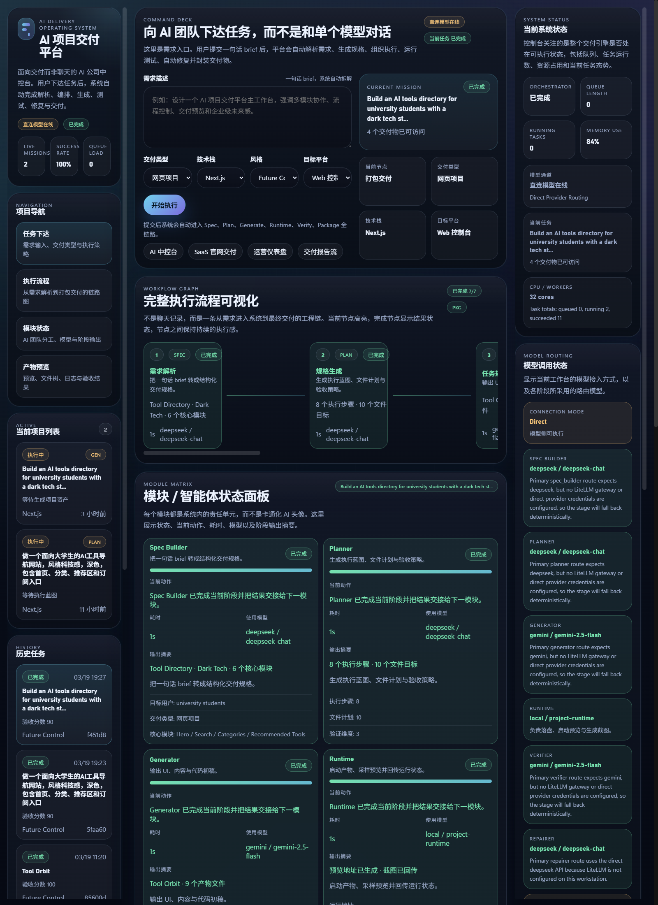

# Swarm Organization

Swarm Organization is an MVP for turning short web project briefs into runnable deliverables.
It takes a one-line request and pushes it through a full delivery loop:

`brief -> structured spec -> execution plan -> generated project -> runtime preview -> verification -> repair -> package`

The current implementation is intentionally pragmatic: a Node.js runtime that keeps the system runnable end-to-end while preserving clean stage boundaries for a later Python migration.



## What It Does

- Accepts short project briefs from a Web UI or HTTP API
- Translates the brief into a structured delivery spec
- Builds a file plan and verification strategy
- Generates a runnable website starter
- Produces preview assets, a delivery report, and a zip package
- Verifies engineering and content quality, then retries repair when needed
- Exposes task state, events, metrics, artifacts, and model-routing status

## Why This Repo Exists

Most AI product demos stop at "generate some text" or "chat with a model."
This project explores a different product shape: an order-style delivery system where the user submits a request and the platform orchestrates a production pipeline around it.

That makes it useful for validating:

- AI-assisted internal delivery tooling
- brief-to-project automation flows
- multi-stage orchestration around LLMs
- verification and repair loops for generated outputs
- product direction before investing in a heavier backend stack

## Product Shape

The system is organized as explicit delivery stages:

1. `Spec Builder`
   Turns a raw brief into structured project requirements.
2. `Planner`
   Produces steps, file targets, and verification expectations.
3. `Generator`
   Writes the runnable project starter and supporting files.
4. `Runtime`
   Loads the generated output and produces a preview asset.
5. `Verifier`
   Checks runtime health, required files, sections, and content quality.
6. `Repairer`
   Rebuilds and re-verifies when the output does not pass.
7. `Packager`
   Emits the final report, summary, and downloadable zip package.

## Web UI

The Web UI is designed as a control console rather than a chat surface.
It shows:

- task intake
- workflow visualization
- module status
- artifact previews
- task history
- runtime and model-routing state

Start the local server and open:

```text
http://127.0.0.1:3000
```

## Quick Start

### Requirements

- Node.js 18+

### Install and Run

```bash
npm start
```

Then open:

```text
http://127.0.0.1:3000
```

### Optional Environment Setup

Copy `.env.example` to `.env` if you want to enable LiteLLM or direct provider routing:

```bash
cp .env.example .env
```

If no gateway or provider keys are configured, the system falls back to deterministic local behavior so the MVP remains runnable.

## Usage

### From the Web UI

1. Enter a short project brief.
2. Pick delivery type, framework, style, and target platform.
3. Submit the task.
4. Watch the pipeline progress through spec, planning, generation, runtime, verification, repair, and packaging.
5. Open the generated preview, report, summary, or zip artifact.

### From the API

Create a task:

```bash
curl -X POST http://127.0.0.1:3000/api/tasks \
  -H "Content-Type: application/json" \
  -d '{
    "prompt": "Build a dark tech AI tools directory for university students",
    "outputType": "web_project",
    "framework": "nextjs",
    "style": "dark_tech",
    "targetPlatform": "web"
  }'
```

Check task status:

```bash
curl http://127.0.0.1:3000/api/tasks
curl http://127.0.0.1:3000/api/tasks/<task-id>
```

## API Endpoints

- `GET /api/health`
- `GET /api/model-status`
- `GET /api/tasks`
- `POST /api/tasks`
- `GET /api/tasks/:id`
- `GET /api/metrics`
- `GET /api/events`
- `GET /artifacts/...`

## Output Artifacts

Each successful task writes artifacts under `deliveries/<task-id>/`:

- `project/`
- `preview/home.svg`
- `project.zip`
- `delivery_report.json`
- `delivery_summary.md`

## Model Routing

The backend supports staged model routing for:

- `Spec Builder`
- `Planner`
- `Generator`
- `Verifier`
- `Repairer`
- `Finalizer`

You can configure provider, model, and fallback chains per stage via `.env.example`.
The runtime supports both:

- LiteLLM gateway mode
- direct provider mode

When neither is configured, deterministic fallback keeps the local system working.

## Project Structure

```text
src/
  core/        scheduler, task store, events, KB, cost, resource monitor
  engines/     spec, planner, generator, runtime, verifier, repairer, packager
  llm/         LiteLLM and direct-provider client
  utils/       shared helpers
web/           local Web UI
scripts/       smoke and regression checks
docs/          architecture notes and assets
data/          local state and caches at runtime
deliveries/    generated outputs at runtime
```

## Verification

Run the local smoke flow:

```bash
npm run smoke
```

Run backend regression checks:

```bash
npm run backend-check
```

## Architecture Notes

See [docs/architecture.md](docs/architecture.md) for the current stage architecture and migration direction.

## Current Constraints

- This is an MVP, not a production multi-tenant system.
- Persistence is still file-based.
- The primary delivery target is a generated web project starter.
- The long-term Python stack is planned but not yet implemented in this repo.

## Planned Direction

The intended long-term stack is:

- Python
- FastAPI
- Pydantic
- PostgreSQL
- Redis
- LangGraph

This repository keeps the runtime in Node.js for now so the delivery loop remains executable on a minimal workstation.
