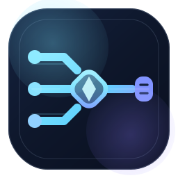
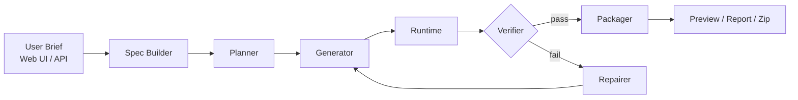

# Swarm Organization

<p align="center">
  
</p>

<p align="center">
  <strong>Turn one-line briefs into production-ready deliverables.</strong>
</p>

<p align="center">
  <a href="https://github.com/lijinrui182/swarm-organization/releases"></a>
  <a href="LICENSE"></a>
  <a href="https://nodejs.org/"></a>
</p>

**Swarm Organization** is an AI-powered delivery pipeline that takes a single-line project brief and orchestrates it through a complete production loop:

`brief -> spec -> plan -> generate -> preview -> verify -> repair -> package`

You submit a request. The platform handles the rest: structured specs, code generation, quality verification, and final packaging.


[Quick Start](#quick-start) | [API Reference](#api-reference) | [Architecture](#architecture) | [Model Routing](#model-routing)

## Why This Exists

Most AI demos stop at "generate some text" or "chat with a model."

Swarm Organization explores a different product shape: an **order-style delivery system** where the user submits a request and the platform orchestrates a full production pipeline around it. No prompt engineering required; just describe what you want.

Use it to validate:

- **AI-assisted internal delivery tooling**: automate repetitive project scaffolding
- **Brief-to-project automation flows**: convert requirements to runnable code
- **Multi-stage LLM orchestration**: coordinate specialized models per pipeline stage
- **Verification and repair loops**: auto-detect and fix quality issues
- **Product direction**: test ideas before investing in a heavier backend stack

## Highlights

- **[7-Stage Pipeline](#product-shape)**: spec, plan, generate, runtime, verify, repair, package
- **[Web Console](#web-console)**: control dashboard with workflow visualization, module status, and artifact previews
- **[HTTP API](#api-reference)**: RESTful endpoints for task creation, status polling, and artifact retrieval
- **[Model Routing](#model-routing)**: per-stage provider/model/fallback configuration via LiteLLM or direct providers
- **[Quality Verification](#verification)**: automated checks for runtime health, file integrity, and content quality
- **[Self-Healing](#product-shape)**: repair loop rebuilds and re-verifies when output fails checks
- **[Portable Output](#output-artifacts)**: generates runnable project starters, previews, reports, and zip packages

## How It Works



Each stage is a discrete engine with clean boundaries, making the system easy to understand, test, and eventually migrate to the planned Python stack.

## Product Shape

| Stage | Engine | Responsibility |
|-------|--------|----------------|
| 1. Spec Builder | `spec-builder.js` | Turns raw brief into structured project requirements |
| 2. Planner | `planner-engine.js` | Produces execution steps, file targets, and verification expectations |
| 3. Generator | `generator-engine.js` | Writes the runnable project starter and supporting files |
| 4. Runtime | `runtime-engine.js` | Loads generated output and produces preview assets |
| 5. Verifier | `verifier-engine.js` | Checks runtime health, required files, sections, and content quality |
| 6. Repairer | `repairer-engine.js` | Rebuilds and re-verifies when output fails verification |
| 7. Packager | `packager-engine.js` | Emits final report, summary, and downloadable zip package |

## Quick Start

### Requirements

- **Node.js** 18+

### Install and Run

```bash
npm start
```

Then open:

```
http://127.0.0.1:3000
```

### Environment Setup (Optional)

Copy `.env.example` to `.env` to enable LiteLLM gateway or direct provider routing:

```bash
cp .env.example .env
```

If no gateway or provider keys are configured, the system falls back to deterministic local behavior. The MVP remains fully runnable without any external API keys.

## Web Console

The Web UI is designed as a **control console** rather than a chat surface. It shows:

- **Task intake**: submit briefs with delivery type, framework, style, and platform options
- **Workflow visualization**: real-time pipeline progress through all 7 stages
- **Module status**: health and state of each engine
- **Artifact previews**: generated previews, reports, and downloadable packages
- **Task history**: track all past deliveries
- **Model routing state**: active providers and fallback chains

## Usage

### From the Web UI

1. Enter a short project brief
2. Pick delivery type, framework, style, and target platform
3. Submit the task
4. Watch the pipeline progress through `spec -> plan -> generate -> runtime -> verify -> repair -> package`
5. Open the generated preview, report, summary, or zip artifact

### From the API

Create a task:

```bash
curl -X POST http://127.0.0.1:3000/api/tasks \
  -H "Content-Type: application/json" \
  -d '{
    "prompt": "Build a dark tech AI tools directory for university students",
    "outputType": "web_project",
    "framework": "nextjs",
    "style": "dark_tech",
    "targetPlatform": "web"
  }'
```

Check task status:

```bash
curl http://127.0.0.1:3000/api/tasks
curl http://127.0.0.1:3000/api/tasks/<task-id>
```

## API Reference

| Endpoint | Method | Description |
|----------|--------|-------------|
| `/api/health` | GET | Health check |
| `/api/model-status` | GET | Model routing status |
| `/api/tasks` | GET | List all tasks |
| `/api/tasks` | POST | Create a new task |
| `/api/tasks/:id` | GET | Get task status and details |
| `/api/metrics` | GET | System metrics |
| `/api/events` | GET | Event stream |
| `/artifacts/...` | GET | Download generated artifacts |

## Output Artifacts

Each successful task writes artifacts under `deliveries/<task-id>/`:

| Path | Description |
|------|-------------|
| `project/` | Generated runnable project starter |
| `preview/home.svg` | Visual preview asset |
| `project.zip` | Downloadable project package |
| `delivery_report.json` | Structured delivery report |
| `delivery_summary.md` | Human-readable delivery summary |

## Model Routing

The backend supports staged model routing for each pipeline stage:

- **Spec Builder**: structured requirement extraction
- **Planner**: execution plan generation
- **Generator**: code and file generation
- **Verifier**: quality assessment
- **Repairer**: fix and rebuild
- **Finalizer**: report and packaging

Configure provider, model, and fallback chains per stage via `.env.example`.

Supported modes:

- **LiteLLM gateway**: unified proxy for multiple providers
- **Direct provider**: native API integration
- **Deterministic fallback**: no external keys required for local development

## Architecture

```text
src/
  core/              Delivery engine, task store, event hub, knowledge base, cost manager, resource monitor
  engines/           7 pipeline engines + model router
  llm/               LiteLLM client and provider abstraction
  utils/             Shared helpers (env, hash, id, json, zip)
web/                 Local Web Console (HTML/CSS/JS)
scripts/             Smoke tests and regression checks
docs/                Architecture notes and assets
```

### Key Subsystems

- **[Delivery Engine](src/core/delivery-engine.js)**: orchestrates the 7-stage pipeline with state management
- **[Task Store](src/core/task-store.js)**: file-based task persistence and status tracking
- **[Event Hub](src/core/event-hub.js)**: real-time event streaming for UI and API consumers
- **[Knowledge Base](src/core/knowledge-base.js)**: domain knowledge for spec and planning stages
- **[Cost Manager](src/core/cost-manager.js)**: token usage tracking and cost estimation
- **[Resource Monitor](src/core/resource-monitor.js)**: system resource usage and health checks
- **[Model Router](src/engines/model-router.js)**: per-stage provider selection with fallback chains

See [docs/architecture.md](docs/architecture.md) for detailed architecture documentation and migration direction.

## Verification

Run local smoke test:

```bash
npm run smoke
```

Run backend regression checks:

```bash
npm run backend-check
```

## Current Constraints

- **MVP stage**: not a production multi-tenant system
- **File-based persistence**: no database yet
- **Web project focus**: primary delivery target is generated website starters
- **Node.js runtime**: clean stage boundaries preserved for planned Python migration

## Roadmap

The intended long-term stack:

- **Python** + **FastAPI** + **Pydantic**
- **PostgreSQL** + **Redis**
- **LangGraph** for orchestration

This repository keeps the runtime in Node.js for now so the delivery loop remains executable on a minimal workstation with zero infrastructure dependencies.

## Star History

[](https://www.star-history.com/#lijinrui182/swarm-organization&type=date)

## License

[MIT](LICENSE)

